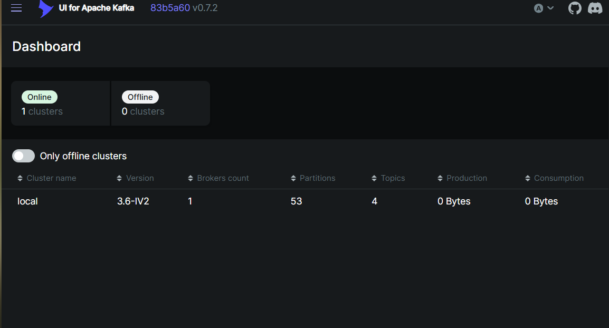
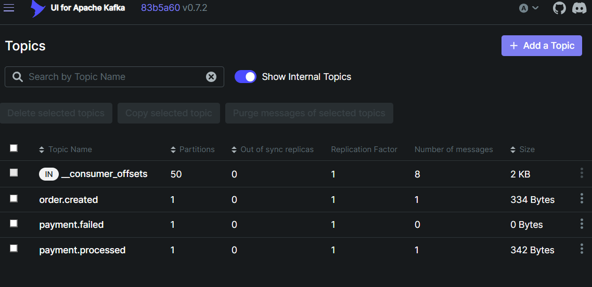
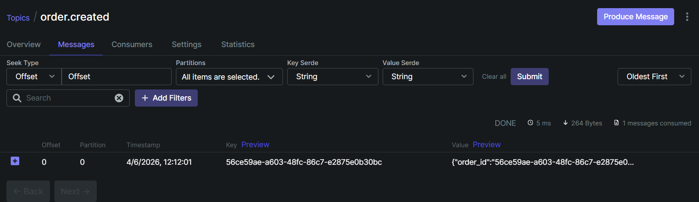

# E-Commerce Microservices Backend

A production-style distributed e-commerce backend built in Go, demonstrating real-world microservices patterns including synchronous gRPC communication, asynchronous event-driven architecture with Kafka, JWT authentication, and full Docker containerisation.

---

## Architecture

```
           ┌─────────────────────────────────────┐
           │           Client (REST)             │
           └─────────────────┬───────────────────┘
                             │ HTTP/JSON
              ┌──────────────▼──────────────┐
              │         API Gateway         │
              │      Gin · JWT Auth         │
              └──┬─────────┬────────┬───────┘
                 │ gRPC    │ gRPC   │ gRPC
        ┌────────▼─┐  ┌────▼────┐ ┌▼──────────┐ ┌────────────┐
        │  User    │  │Product  │ │  Order    │ │  Payment   │
        │ Service  │  │Service  │ │  Service  │ │  Service   │
        └──────────┘  └─────────┘ └─────┬─────┘ └─────┬──────┘
                                         │publish       │publish
                                  ┌──────▼──────────────▼──────┐
                                  │         Apache Kafka       │
                                  │  • order.created           │
                                  │  • payment.processed       │
                                  │  • payment.failed          │
                                  └──────────────┬─────────────┘
                                                 │ consume
                                        ┌────────▼────────┐
                                        │  Notification   │
                                        │    Service      │
                                        └─────────────────┘
                                  ┌──────────────────────────┐
                                  │        PostgreSQL        │
                                  └──────────────────────────┘
```

---

## Services

| Service | Role |
|---|---|
| **api-gateway** | Single entry point — translates REST to gRPC, validates JWT tokens |
| **user-service** | User registration, login, and JWT issuance |
| **product-service** | Product catalog with atomic stock management |
| **order-service** | Order creation, orchestrates product and payment flow |
| **payment-service** | Processes payments asynchronously via Kafka |
| **notification-service** | Sends email/SMS notifications on payment events |

---

## Tech Stack

| Technology | Purpose |
|---|---|
| **Go** | All services — chosen for performance and built-in concurrency |
| **gRPC** | Synchronous service-to-service communication |
| **Apache Kafka** | Async event bus for order → payment → notification flow |
| **PostgreSQL** | Persistent storage for all services |
| **Docker + Compose** | Containerisation and local orchestration |
| **JWT** | Stateless authentication at the API gateway |
| **GORM** | ORM with auto-migration |
| **Gin** | HTTP framework for the REST gateway |

---

## Async Order Flow

The most interesting part of the system — placing an order triggers a chain of async events:

```
POST /orders
    │
    ├── gRPC → product-service   (validate product, deduct stock atomically)
    ├── Save order to PostgreSQL (status: pending)
    └── Publish → Kafka: order.created
                            │
                    payment-service (consumes async)
                            ├── Processes payment via mock gateway
                            ├── Save payment to PostgreSQL
                            └── Publish → Kafka: payment.processed
                                                    │
                                        notification-service
                                                    └── Send email/SMS
```

The client receives a `201 Created` with the order ID **immediately** — payment processing happens in the background. This is the same pattern used by real e-commerce platforms like Amazon and Flipkart.

---

## Key Design Decisions

**gRPC for internal communication**
Services communicate using gRPC with a custom JSON codec. This gives strongly typed contracts between services, making it easy to catch breaking changes at compile time rather than at runtime.

**Kafka for async payment processing**
Decoupling order creation from payment processing means the system stays responsive under load. If the payment service goes down, orders are queued in Kafka and processed when it recovers — no data loss.

**Atomic stock deduction**
The product service uses `SELECT FOR UPDATE` inside a database transaction to prevent race conditions. Two concurrent orders for the last item in stock cannot both succeed.

**Idempotent payments**
The payment service checks for an existing payment before processing. This makes it safe to retry failed Kafka deliveries without charging the customer twice.

**JWT validation at the gateway only**
Internal gRPC calls are trusted within the Docker network. Only the API gateway validates tokens, keeping internal services simple. Production would add mTLS for internal service authentication.

---

## API Reference

All endpoints except `/auth/*` require `Authorization: Bearer <token>`.

### Auth
| Method | Endpoint | Description |
|---|---|---|
| POST | `/api/v1/auth/register` | Create a new user account |
| POST | `/api/v1/auth/login` | Login and receive a JWT token |

### Products
| Method | Endpoint | Description |
|---|---|---|
| POST | `/api/v1/products` | Add a product to the catalog |
| GET | `/api/v1/products` | List all products (paginated) |
| GET | `/api/v1/products/:id` | Get a single product |

### Orders
| Method | Endpoint | Description |
|---|---|---|
| POST | `/api/v1/orders` | Place an order (triggers async payment) |
| GET | `/api/v1/orders` | List current user's orders |
| GET | `/api/v1/orders/:id` | Get a single order |

### Payments
| Method | Endpoint | Description |
|---|---|---|
| GET | `/api/v1/payments/:id` | Get payment status by ID |

---

## Project Structure

```
ecommerce-microservices/
├── proto/                  # gRPC service contracts (types, client, server)
│   ├── user/
│   ├── product/
│   ├── order/
│   └── payment/
├── shared/                 # Shared packages used across services
│   ├── codec/              # Custom JSON gRPC codec
│   ├── config/             # Environment-based configuration
│   ├── events/             # Kafka event payload definitions
│   ├── kafka/              # Producer and consumer helpers
│   └── middleware/         # JWT authentication middleware
├── services/
│   ├── api-gateway/        # REST → gRPC translation layer
│   ├── user-service/
│   ├── product-service/
│   ├── order-service/
│   ├── payment-service/
│   └── notification-service/
└── docker-compose.yml
```

---

## Results

### Kafka Cluster Online — 4 Topics Active



Kafka broker running with all 3 application topics auto-created: `order.created`, `payment.processed`, and `payment.failed`.

---

### Kafka Topics — Messages Flowing



After placing an order:
- `order.created` — **1 message** (published by order-service)
- `payment.processed` — **1 message** (published by payment-service after consuming `order.created`)
- `payment.failed` — **0 messages** (payment succeeded this time)

This confirms the full async chain is working: order → Kafka → payment → Kafka → notification.

---

### order.created Message Payload



The raw event published to Kafka by the order-service, containing `order_id`, `user_id`, `product_id`, `quantity`, `amount`, and `created_at`. The payment-service consumes this event and processes the payment asynchronously.